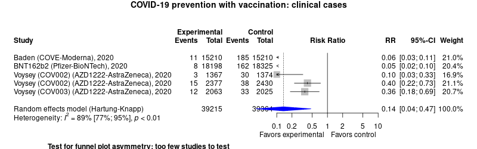

COVID-19 prevention with vaccination
============================================
A expert-driven, 'really rapid' living systematic review

Short url: http://openmetaanalysis.github.io/covid-19/

**Clinical summary:** This meta-analysis suggests that clinical intervention *is* effective. However, the heterogeneity of results as measured by I2 was '[substantial](http://handbook-5-1.cochrane.org/chapter_9/9_5_2_identifying_and_measuring_heterogeneity.htm)' at 88% before creating clinical subgroups. 

<!--
An excellent clinical interpretation of this data is at
> Sax, Paul. Does Remdesivir Actually Work? HIV and ID Observations [Internet]. 2020 Oct 18 [cited 2020 Oct 20]; Available from: https://blogs.jwatch.org/hiv-id-observations/index.php/does-remdesivir-actually-work/2020/10/18/
-->

<!--
Meta-regression of common modulators (year of publication, study size, event rate in the control groups) finds that the outcome of the intervention is effected by xx.
* [Reconciliation of conclusions with prior meta-analyses](files/reconciliation-tables/Reconciliation%20of%20conclusions.pdf) (under construction)
* [Keep current with this topic](files/searching/Keep-up.md) (under construction)

-->
Acknowledgement: we acknowledge the essential work by the authors of the prior [systematic review(s)](#systematic-reviews) listed below.

**Methods overview:** This repository is an [openMetaAnalysis](https://openmetaanalysis.github.io/) expert-drive systematic review in which the choice of articles, metrics, and displays are entirely drive by  group of one of more clinical experts. This analysis may update one or more previously published review(s) below. Newer studies included are listed in the references below. Rationale for newer trials excluded may be listed at the end of the references. 
* [Methods](http://openmetaanalysis.github.io/methods.html) for openMetaAnalysis
* [Evidence search](files/searching/evidence-search.md) for this review (under construction)

**Results:** Details of the studies included are in the:
* [Reconciliation of trials included with prior meta-analyses/](files/reconciliation-tables/Reconciliation%20of%20studies.pdf) (under construction)
* [Description of studies (PICO table)](files/study-details/table-pico.pdf) (under construction)
* [Risk of bias assessment](files/study-details/table-bias.pdf) (under construction)
* [Forest plots](../master/files/forest-plots) ([source data](files/data))
* [Network plots](../master/files/network) (optional)
* [Reconciliation of conclusions with prior meta-analyses](files/reconciliation-tables/Reconciliation%20of%20conclusions.pdf) (under construction)

The forest plot for the primary outcomes are below. Additional [forest plots](files/forest-plots) of secondary analyses may be available. 

<!--
The meta-regression for the primary outcomes are below. Additional [meta-regressions](files/metaregression) of secondary analyses may be available. 
 (under construction)

The GRADE Profile is below.  (under construction)
-->
References:
----------------------------------

### Systematic review(s)
#### Most recent review at time of last revision of this repository
NA

### Randomized controlled trials
#### New trial(s) *not* included in the most recent review above
1. Voysey, Merryn (2020). "Safety and efficacy of the ChAdOx1 nCoV-19 vaccine (AZD1222) against SARS-CoV-2: an interim analysis of four randomised controlled trials in Brazil, South Africa, and the UK". Lancet: 1–55. doi:[10.1016/S0140-6736(20)32661-1](http://doi.org/10.1016/S0140-6736(20)32661-1). <!-- PMID: [32445440](http://pubmed.gov/32445440). -->
2. Vaccines and Related Biological Products Advisory Committee Meeting. Available at https://www.fda.gov/media/144245/download

#### Trial(s) included in the review above
None

#### Trial(s) undergoing review
None

#### Trial(s) excluded - selected list of important trial(s)
NA

#### Cited by
This repository is cited by:

1. WikiDoc contributors. Pending content page. WikiDoc. Nov 9, 2014. Available at: http://www.wikidoc.org/index.php/This_topic. Accessed November 9, 2014. 

-------------------------------
[Cite and use this content](https://github.com/openMetaAnalysis/openMetaAnalysis.github.io/blob/master/reusing.MD)  - [Edit this page](../../edit/master/README.md) - [License](files/LICENSE.md) - [History](../../commits/master/README.md)  - 
[Issues and comments](../../issues?q=is%3Aboth+is%3Aissue)

